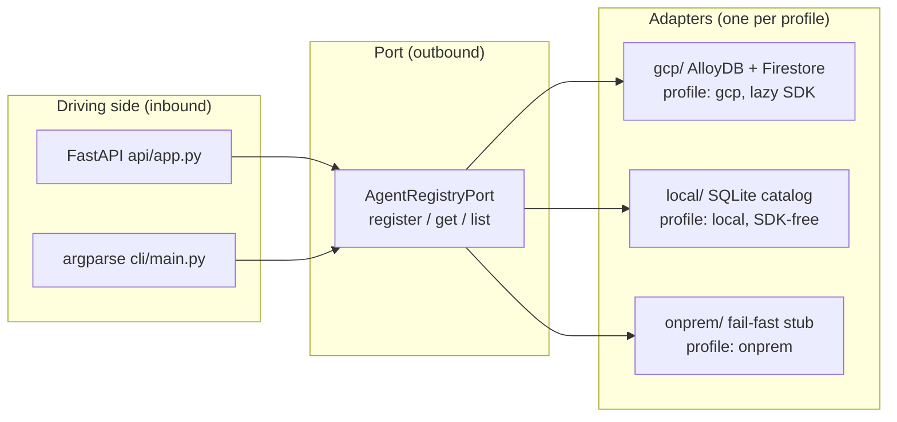
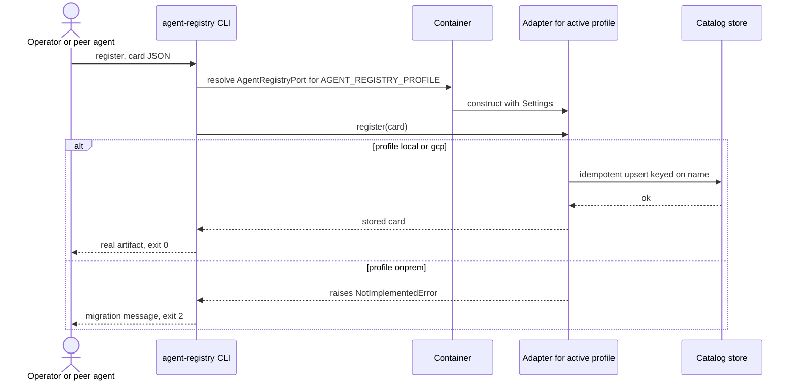

# Architecture: Hrz3 Agent Registry & Governance

This document goes deeper than the [README](README.md): the port to adapter table across the
three deployment profiles, the request flow as a sequence diagram, and how the `local`
profile runs the whole catalog off-cloud.

The wire contract is authoritative in [`SPEC.md`](SPEC.md). This file describes how the
pieces fit together; it does not redefine them.

---

## 1. Hexagonal overview

Hrz3 is a **ports-and-adapters** (hexagonal) application. The HTTP app, the CLI and the
container above the adapter layer never change between profiles. Everything the service needs
from a store is expressed as a `typing.Protocol` **port**; concrete **adapters** are bound to
the port by dotted path in [`config/settings.yaml`](config/settings.yaml) and instantiated
lazily by the `Container` in [`container.py`](src/agent_registry/container.py).

---

## 2. Port to adapter table

One port, three interchangeable adapter families. The `local` column is the WORKING offline
stack; the `onprem` column is the fail-fast migration target.

| Port | `gcp` adapter | `local` adapter | `onprem` adapter |
|---|---|---|---|
| `AgentRegistryPort` | `gcp.alloydb_registry:AlloyDBRegistryAdapter` (JSONB upsert) or `gcp.firestore_registry:FirestoreRegistryAdapter` (doc upsert), lazy SDK imports | `local.sqlite_registry:SqliteRegistryAdapter` (single-file SQLite, idempotent upsert, seedable; optional Firestore-emulator mirror) | `onprem.registry:OnPremRegistryAdapter` (constructs cleanly, raises `NotImplementedError`) |

### Local backend choices

| Concern | `local` backend |
|---|---|
| Persistence | `sqlite3` table `agent_cards(name PRIMARY KEY, card TEXT, updated_at)`, card body stored as JSON via `cards.card_to_dict` |
| Upsert | `INSERT ... ON CONFLICT(name) DO UPDATE`, idempotent on `name` |
| Determinism | `db_path=":memory:"` in tests; `seed(cards)` / `add(cards)` for deterministic loads |
| Thread-safety | `check_same_thread=False` connection guarded by an `RLock` (safe under the FastAPI thread pool) |
| Default path | `~/.agent_registry/local.db` (resolved at call time, override via `AGENT_REGISTRY_LOCAL_DB`) |
| Emulator opt-in | when `FIRESTORE_EMULATOR_HOST` is set AND `google-cloud-firestore` imports, writes mirror to the Firestore emulator (lazy import, only on that branch) |

There is no emulator for AlloyDB, so the SQLite path is the unconditional default for the
SDK-free local stack.

---

## 3. Register flow (sequence)

---

## 4. Profile switch is the only change

Moving from the offline catalog to managed persistence is a one-line change of
`AGENT_REGISTRY_PROFILE` (and, for `gcp`, `backend: alloydb | firestore`). The FastAPI app, the
CLI, `cards.py`, `models.py` and `container.py` are identical across profiles, which is the
no-lock-in proof (see [`COMPLIANCE.md`](COMPLIANCE.md), P-02 and P-12).
