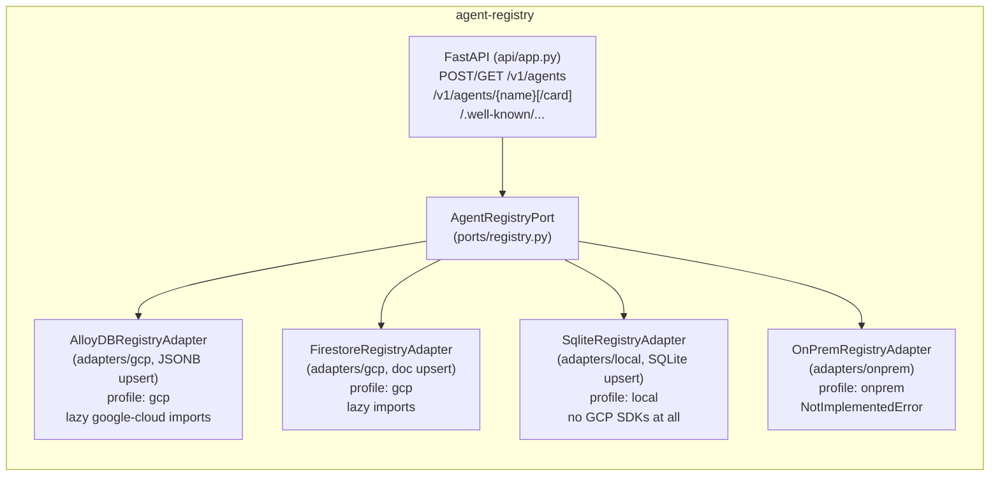
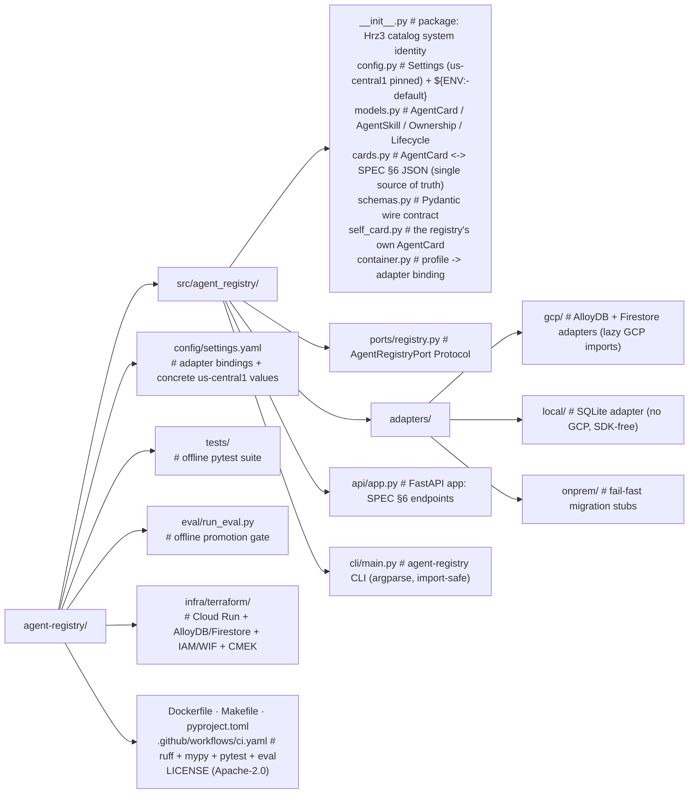

# Hrz3: Agent Registry & Governance (`agent-registry`)

**Industries:** All GenAI (cross-industry)

> The governed **catalog / gallery of agents** for the Horizon agent platform: identity,
> ownership, scoped entitlements, and A2A / MCP discovery. Registering every agent here is
> what **kills shadow AI**: dependency rule **R4**. An agent that is not in the registry is
> not governed, not discoverable, and not allowed to run on the platform.

`agent-registry` is **catalog system Hrz3**, one of the three mandatory platform
dependencies of the **Rsk1 Compliance Assistant** (`compliance-advisory`), alongside
**Hrz1** Guardrail Gateway (`agent-guardrail-gateway`) and **Hrz5** Observability/Audit
(`agent-observability`). Its HTTP API implements the Hrz3 contract in
[`SPEC.md` §6](https://github.com/portable-genai/compliance-advisory/blob/main/SPEC.md)
exactly, so Rsk1's `RemoteRegistryAdapter` talks to it without any translation.

Key guides: [demo](DEMO.md), [adoption](docs/ADOPTING.md),
[FAQs](docs/faq/README.md),
[practices audit](docs/practices-audit.md).

- **Python 3.12**, **FastAPI + uvicorn**, full type hints, `from __future__ import annotations`, ruff-clean.
- **Region selected at deployment**, validated against a residency allowlist, and defaulted
  to `us-central1`.
- **Three deployment profiles** behind one port: `gcp` (managed AlloyDB / Firestore),
  `local` (a WORKING offline SQLite catalog, SDK-free), and `onprem` (fail-fast Google
  Distributed Cloud migration target). `local` runs the whole catalog with **no Google
  Cloud SDKs installed**.
- **Apache-2.0**, public.

## Deployment profiles

Select the adapter stack with `HRZ_REGISTRY_PROFILE` (or `profile:` in
`config/settings.yaml`). Neither supplies a default: naming no profile binds the `local`
adapters but withholds the openings `local` is granted, so a lost config map refuses rather
than serving unauthenticated (SPEC §1). Nothing above the adapter layer changes
between profiles.

| Profile | Catalog backend | Google Cloud SDKs | Use |
|---|---|---|---|
| `gcp` | AlloyDB for PostgreSQL (JSONB upsert) or Firestore (one doc per agent), lazy SDK imports | required (`[gcp]` extra) | Production (set `HRZ_REGISTRY_PROFILE=gcp` explicitly). |
| `local` | single-file **SQLite** catalog, idempotent upsert, seedable | **none** | What dev / test / CI name explicitly. Runs offline, no API key, no emulator. |
| `onprem` | fail-fast placeholders (`NotImplementedError`) | none | Documented Google Distributed Cloud migration target; the CLI exits `2`. |

Optional, higher-fidelity local dev: when `FIRESTORE_EMULATOR_HOST` is set **and**
`google-cloud-firestore` (the `[gcp]` extra) is importable, the `local` adapter mirrors writes
to the official **Firestore emulator**. The google client is imported lazily, only on that
branch, so the `local` path imports no google-cloud package.

---

## What Hrz3 does

| Concern | How Hrz3 provides it |
|---|---|
| **Identity** | Every agent has a stable `name` (the catalog key) and a published `AgentCard`. |
| **Ownership** | `governance.owner` (team / contact / organization), the anti-shadow-AI anchor. |
| **Scoped entitlements** | `governance.scopes`: least-privilege scopes the agent may exercise (e.g. `mcp:tool:agent_search.query`, `a2a:invoke:agent-guardrail-gateway`). |
| **A2A / MCP interop** | The A2A AgentCard served at `/.well-known/agent-card.json`, plus a per-agent `/v1/agents/{name}/card` passthrough. |
| **Discovery** | `GET /v1/agents` exposes only release-approved cards; governance inventory has a separate endpoint. |
| **Lifecycle governance** | New cards are forced to `draft`. A server-side evidence verifier resolves Hrz4/Hrz5 references before activation. |

---

## HTTP API (SPEC §6, Hrz3)

All JSON field names mirror the domain dataclasses; enums are strings. The **Auth** column
marks the routes that require service-to-service auth (see below).

| Method & path | Body | Response | Auth |
|---|---|---|---|
| `POST /v1/agents` | `{AgentCard}` | `201` `{AgentCard}` (+ `Location` header) | S2S |
| `POST /v1/agents/{name}/release` | `{eval_run_id, audit_event_id}` | `200` released `{AgentCard}`; `409` on unverifiable evidence | S2S |
| `GET /v1/agents/{name}` | n/a | `200` `{AgentCard}` · `404` if absent | S2S |
| `GET /v1/agents` | n/a | `200` release-approved `[{AgentCard}, ...]` | S2S |
| `GET /v1/governance/agents` | n/a | `200` all lifecycle states for governance review | S2S |
| `GET /v1/governance/agents/{name}` | n/a | `200` any registered lifecycle state | S2S |
| `GET /v1/capabilities` | n/a | `200` runtime capability and assurance manifest | open |
| `GET /.well-known/agent-card.json` | n/a | `200` the registry's **own** card | open |
| `GET /v1/agents/{name}/card` | n/a | `200` `{AgentCard}` · `404` (A2A passthrough) | S2S |
| `GET /healthz` | n/a | `200` `{"status": "ok"}` | open |

**Service-to-service auth.** The catalog CRUD and per-agent resolution routes (**S2S** above)
authenticate the calling service and fail closed; `/healthz` and the public A2A discovery card
stay open. Callers send `Authorization: Bearer <token>` (`src/agent_registry/api/security.py`):
under a deliberately chosen `local` a constant-time shared-secret compare against
`HRZ_REGISTRY_S2S_TOKEN` (unset => open for loopback dev so the offline gate runs with no
secret; set to a secret => `401` without it; set to an empty value => `503`, never the unset
opening); under `gcp` a Google-signed OIDC ID token verified against
`HRZ_REGISTRY_S2S_AUDIENCE`, with the caller service account checked against
`HRZ_REGISTRY_S2S_ALLOWED_CALLERS` (`403` if not allowed). If no profile was ever named, the
guarded routes refuse with a `503` rather than inheriting the `local` opening.

### The `AgentCard` JSON

The first six fields are the **A2A discovery contract** (SPEC §6). A plain A2A / MCP client
sees only these and ignores the rest:

```json
{
  "name": "compliance-advisory",
  "description": "Rsk1 Compliance Assistant, grounded RAG over MAS/HKMA/APRA/FSA.",
  "url": "https://compliance-advisory.us-central1.example/a2a",
  "version": "1.0.0",
  "provider": "compliance-advisory",
  "skills": [
    { "id": "answer", "name": "Grounded compliance Q&A", "description": "Cited answers." }
  ]
}
```

Hrz3 layers **governance** on top in an *additive* `governance` block, so the catalog can
enforce ownership and least-privilege without breaking vanilla A2A clients:

```json
{
  "...": "the six A2A fields above",
  "governance": {
    "owner": { "team": "rsk-compliance", "contact": "compliance-eng@bank.example", "organization": "APAC Bank" },
    "lifecycle": "active",
    "scopes": ["a2a:invoke:agent-guardrail-gateway", "mcp:tool:agent_search.query"],
    "protocols": ["a2a", "mcp"]
  }
}
```

`register` is an **idempotent upsert** keyed on `name`: agents re-publish their card on every
deploy and the row updates in place. It cannot replace the reserved registry self-card and
cannot publish an active card directly.

The release request contains identifiers only. In `gcp`, Hrz3 calls the trusted
`HRZ_RELEASE_VERIFIER_URL` with `HRZ_RELEASE_VERIFIER_TOKEN`; the verifier returns the
passing/attested Hrz4 evidence, durable reference, Hrz5 audit linkage, approver and release
time. Caller-supplied status, attestation, evidence URI or approver fields are never accepted.
The laptop profile recognizes only exact fictional demo identifiers derived from agent name
and version, so the release flow remains functional without presenting demo strings as
production evidence.

---

## Interop: A2A v1.0 + MCP 2026-07-28

Hrz3 is built for the two interop standards the platform pins (SPEC §3):

**A2A v1.0 (Agent-to-Agent).** Under A2A, an agent advertises its capabilities as an
**AgentCard** served at the well-known path `/.well-known/agent-card.json`; a peer fetches
that card to learn the agent's `skills`, endpoint `url` and `version` *before* initiating a
task. Hrz3 is itself an A2A agent: `GET /.well-known/agent-card.json` returns the registry's
own card (skills: `register`, `resolve`, `discover`). For every *registered* agent, Hrz3 also
exposes the card it would serve at its own well-known path via the passthrough
`GET /v1/agents/{name}/card`, so an orchestrator can resolve a peer's card through the
catalog without first knowing the peer's URL. This makes Hrz3 the **A2A discovery hub**.

**MCP 2026-07-28 (Model Context Protocol).** MCP governs how agents reach *tools / context
servers*. Hrz3 does not proxy MCP traffic; it governs it. The `governance.scopes` on a card
declare exactly which MCP tools an agent is entitled to call (e.g.
`mcp:tool:agent_search.query`) and which A2A peers it may invoke. The platform's guardrail
and runtime layers read these scopes from the catalog to enforce least privilege, and
`governance.protocols` records which interop protocols (`a2a`, `mcp`) each agent speaks so
discovery can filter by capability. Pinning to the **2026-07-28** MCP revision keeps the
scope vocabulary aligned across Hrz1 (guardrail), Hrz3 (registry) and the agents themselves.

---

## Architecture: ports & adapters



- **One port**, `AgentRegistryPort`: `register(card)` / `get(name)` / `list()`. Same shape
  as Rsk1's `AgentRegistryPort`, so the in-process contract is identical on both ends of the wire.
- **`adapters/gcp/`**: managed-store adapters. **AlloyDB** for PostgreSQL (default; card
  stored as `JSONB`, idempotent `INSERT ... ON CONFLICT DO UPDATE`) or **Firestore** in Native
  mode (one document per agent). **All Google Cloud SDK imports are lazy** (inside
  `__init__` / methods), so importing the package under the `local` profile needs nothing
  from Google Cloud installed.
- **`adapters/local/`**: a single-file **SQLite** catalog (`SqliteRegistryAdapter`), idempotent
  upsert, thread-safe, seedable. Lets the service, the CLI and the tests run fully offline with
  no Google Cloud SDKs. Routes to the Firestore emulator only when opted in (see above).
- **`adapters/onprem/`**: fail-fast placeholders that construct cleanly and satisfy the Protocol
  but raise `NotImplementedError` from every method (the Google Distributed Cloud migration
  target). No third-party product is named.
- **`container.py`** binds the active `profile` to a concrete adapter by the dotted path in
  `config/settings.yaml` under `adapters:`; every adapter constructor is
  `def __init__(self, settings: Settings) -> None`.
- **`cards.py`** is the single source of truth for the `AgentCard` ↔ JSON mapping, so the
  HTTP layer, the persistence adapters and the well-known endpoint never disagree on the shape.

Switching `profile` from `local` to `gcp` (and choosing `backend: alloydb | firestore`)
is the only change needed to move from the offline catalog to managed persistence; no code
above the adapter layer is touched.

---

## Run it locally (offline, no GCP)

The `local` profile is what development names: a SQLite catalog that runs the whole registry
with no Google Cloud SDKs, no API key, and no emulator. Name it explicitly (the Makefile and
`ci.yaml` do); leaving `HRZ_REGISTRY_PROFILE` unset binds the same adapters but refuses the
guarded routes.

```bash
# 1. Create an environment and install (core deps only, no Google Cloud SDKs).
python3.14 -m venv .venv && source .venv/bin/activate
pip install -e ".[dev]"
```

### End-to-end via the CLI (the primary local artifact)

The `agent-registry` CLI publishes and resolves cards against the active profile. Under
`local` it returns a real artifact; under `onprem` it exits `2` with the migration message.

```bash
export HRZ_REGISTRY_PROFILE=local
export HRZ_REGISTRY_LOCAL_DB=/tmp/hrz-registry.db   # the SQLite catalog file (the "seed" store)

# Publish (upsert) an AgentCard, then read it back from the catalog.
agent-registry register --card '{
  "name": "compliance-advisory",
  "description": "Rsk1 Compliance Assistant",
  "url": "https://compliance-advisory.us-central1.example/a2a",
  "version": "1.0.0",
  "provider": "compliance-advisory",
  "skills": [{"id":"answer","name":"Grounded compliance Q&A","description":"Cited answers."}]
}'
agent-registry list                       # -> the JSON array of stored cards
agent-registry get compliance-advisory   # -> the single card

# The same command under onprem fails fast (exit 2) with the migration message:
HRZ_REGISTRY_PROFILE=onprem agent-registry list; echo "exit=$?"   # -> exit=2
```

`make smoke` runs the register-then-list flow in one step.

### Or run the HTTP service

```bash
# Start the service on the local profile (named explicitly).
make run                 # -> uvicorn on http://localhost:8083

# Talk to it.
curl localhost:8083/healthz
curl localhost:8083/.well-known/agent-card.json | jq

curl -X POST localhost:8083/v1/agents -H 'content-type: application/json' -d '{
  "name": "compliance-advisory",
  "description": "Rsk1 Compliance Assistant",
  "url": "https://compliance-advisory.us-central1.example/a2a",
  "version": "1.0.0",
  "provider": "compliance-advisory",
  "skills": [{"id":"answer","name":"Grounded compliance Q&A","description":"Cited answers."}]
}'

curl localhost:8083/v1/agents | jq
curl localhost:8083/v1/agents/compliance-advisory | jq
curl localhost:8083/v1/agents/compliance-advisory/card | jq
```

### Optional: higher-fidelity local with the Firestore emulator

```bash
# Start the official Firestore emulator (needs the [gcp] extra installed), then:
export FIRESTORE_EMULATOR_HOST=localhost:8080
export HRZ_REGISTRY_PROFILE=local
agent-registry register --card '{...}'    # writes mirror to the emulator
```

Without `FIRESTORE_EMULATOR_HOST` (or without the `[gcp]` extra) the local profile stays on the
SDK-free SQLite path. No google-cloud package is imported on the default path.
```

Port **8083** matches Rsk1's `RemoteRegistryAdapter` default (`HRZ_REGISTRY_URL`,
`http://localhost:8083`), so Rsk1 in `profile: platform` resolves agents from this service out
of the box.

### Rsk1 uses Hrz3 like this

```python
# compliance-advisory, profile: platform
# adapters.registry -> compliance_advisory.adapters.platform.remote_registry:RemoteRegistryAdapter
#   register -> POST /v1/agents
#   get      -> GET  /v1/agents/{name}   (404 -> None)
#   list     -> GET  /v1/agents
import os
os.environ["HRZ_REGISTRY_URL"] = "http://localhost:8083"
```

---

## Tests

The suite runs **offline with no Google Cloud SDKs installed** (SPEC §7):

```bash
make test          # pytest
make lint          # ruff check + format --check
make typecheck     # mypy
make check         # lint + typecheck + test
```

What is covered:

- **Contract / interface parity** (`tests/test_contract.py`): the `local` and `onprem`
  adapters both construct with a single `Settings` arg and structurally satisfy
  `AgentRegistryPort` with no Google Cloud SDKs; `local` answers offline, `onprem` fails fast
  with `NotImplementedError`; the GCP adapter modules import and construct cleanly with no
  `google-cloud-*` / SQLAlchemy installed (lazy-import contract).
- **Local SQLite adapter** (`tests/test_local_registry.py`): register / get / list, idempotent
  upsert, full governance round-trip, default-path resolution.
- **CLI** (`tests/test_cli.py`): `register` / `get` / `list` return real artifacts under
  `local`; every command exits `2` under `onprem`.
- **Eval gate** (`tests/test_eval_gate.py`): the offline promotion gate passes on the local
  adapter (catalog-correctness invariants).
- **Card mapping** (`tests/test_cards.py`): SPEC §6 round-trip, governance round-trip,
  tolerant parsing of plain A2A cards, enum `.value` serialisation.
- **HTTP contract** (`tests/test_api_contract.py`): all SPEC §6 endpoints, 404s, the
  well-known card, the passthrough, and a test that re-implements Rsk1's `_parse_card` to prove
  the response is exactly what the Rsk1 remote client reads.

---

## Configuration

`config/settings.yaml` is loaded into a single frozen `Settings` object with
`${ENV:-default}` interpolation and handed to every adapter constructor.

Managed release activation is fail-closed against a registry-owned policy: Hrz4 evidence
must match the approved dataset digest, evaluator, threshold digest, artifact classes and
red-team categories, with no unresolved review. The Hrz5 reviewer-only approval must be
`allowed` and match the same policy version. Both reads use workload identity.

| Setting | Env override | Default |
|---|---|---|
| `project_id` | `GOOGLE_CLOUD_PROJECT` | `your-gcp-project` |
| `region` | `GCP_REGION` | `us-central1` |
| `profile` | `HRZ_REGISTRY_PROFILE` | _empty_ (no default anywhere; dev/CI set `local`, production sets `gcp`, both explicitly) |
| `local.db_path` | `HRZ_REGISTRY_LOCAL_DB` | _empty_ (=> `~/.agent_registry/local.db`) |
| `backend` | `HRZ_REGISTRY_BACKEND` | `alloydb` (`alloydb` \| `firestore`) |
| `kms_key` | `HRZ_REGISTRY_KMS_KEY` | _empty_ (regional CMEK key under gcp) |
| `registry.public_url` | `HRZ_REGISTRY_PUBLIC_URL` | `https://agent-registry.us-central1.run.app` |
| `registry.quality_url` | `HRZ_QUALITY_URL` | _empty_ (required by `gcp` release) |
| `registry.observability_url` | `HRZ_OBSERVABILITY_URL` | _empty_ (required by `gcp` release) |
| `alloydb.instance_uri` | `HRZ_REGISTRY_ALLOYDB_URI` | _empty_ |

To use Firestore instead of AlloyDB, set `backend: firestore` and point the `gcp` binding at
`agent_registry.adapters.gcp.firestore_registry:FirestoreRegistryAdapter`.

---

## Container

```bash
make docker-build
docker run --rm -p 8083:8083 \
  -e HRZ_REGISTRY_PROFILE=local \
  agent-registry:latest
```

The image is a two-stage build (slim digest-pinned base, virtualenv only, no build toolchain
in the runtime stage), runs as non-root uid `10001`, declares a `HEALTHCHECK` against
`/healthz`, and listens on `8083`. It selects the SECURE `gcp` profile explicitly, so a
deployment that forgets an environment variable does not silently fall back to the no-auth
SQLite laptop profile. Pass `-e HRZ_REGISTRY_PROFILE=local` (as above) when you want the
offline store in a container; on Cloud Run, deploy with the service account and CMEK wired by
Terraform.

---

## Infrastructure (`infra/terraform/`)

Region-aware infrastructure with `var.region` validated against `var.allowed_regions`
(default `us-central1`). The module provisions:

- **Cloud Run** v2 service (`agent-registry`, region `us-central1`), ingress
  internal + load balancer, min instances 1, CMEK-encrypted, running as a dedicated
  least-privilege service account.
- **AlloyDB** cluster + primary instance (private IP, regional, CMEK), the catalog store,
  **or** a **Firestore** Native-mode database in `us-central1` (toggle with
  `var.backend`).
- **IAM / Workload Identity**: a runtime service account with only the AlloyDB client /
  Firestore user roles it needs; Cloud Run uses the service identity (Workload Identity), no
  keys.
- **CMEK**: a regional Cloud KMS key ring + key in `us-central1`, granted to the AlloyDB
  / Firestore and Cloud Run service agents.

```bash
cd infra/terraform
terraform init
terraform apply -var="project_id=my-gcp-project"
```

See [`infra/terraform/README.md`](infra/terraform/README.md) for variables and outputs.

---

## Repository layout



---

## Governance mapping

| Rule | How Hrz3 satisfies it |
|---|---|
| **R4: kill shadow AI** | Every agent must publish an `AgentCard` with `owner` before it is discoverable; unregistered agents are invisible to orchestrators and the platform refuses to route to them. |
| Least privilege | `governance.scopes` declares the exact MCP tools / A2A peers an agent may use; Hrz1 and the runtime enforce them. |
| Data residency | Catalog store (AlloyDB / Firestore), KMS key and Cloud Run service are pinned to the selected region with regional CMEK. |
| Lifecycle control | `governance.lifecycle` gates production discoverability (`active`/`deprecated` discoverable, `retired` tombstoned). |

---

## Cost and latency

Size this system's cost and latency with the shared interactive calculator: [**live**](https://portable-genai.github.io/cost-latency-calculator/calc/calculator.html?system=Hrz3) or the [in-repo page](cost-latency-calculator.html). The engine and the pricing book are maintained once in [cost-latency-calculator](https://github.com/portable-genai/cost-latency-calculator).

## License

Apache License 2.0. See [`LICENSE`](LICENSE).
